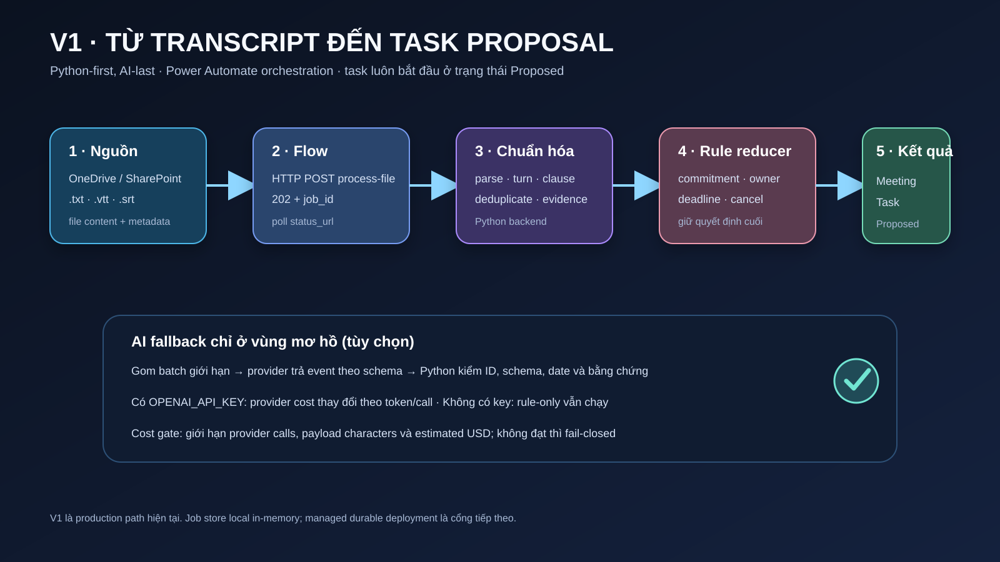
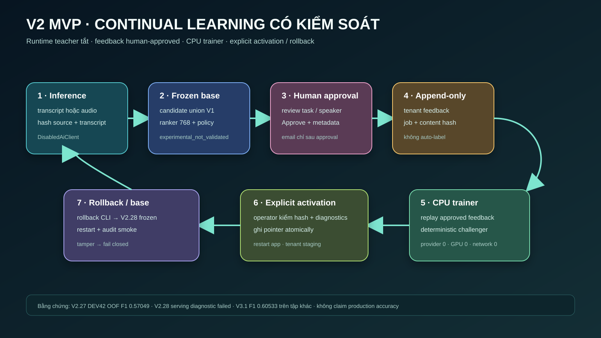

# V1 và V2 MVP: quy trình, bằng chứng và kiểm soát

Tài liệu này là bản giải thích có thể chia sẻ cho người review sản phẩm. V1 là
đường chạy hiện tại qua Power Automate. V2 là MVP nghiên cứu có vòng phản hồi
có kiểm soát nhưng vẫn **opt-in, human-in-the-loop và fail-closed**. Ở local,
vòng này chưa tự chạy liên tục: trainer chỉ chạy khi operator gọi CLI sau khi
feedback được duyệt. Điểm số trong
tài liệu nghiên cứu không phải độ chính xác production của API.

## 1. V1: từ transcript đến task proposal

### Quy trình và phương pháp

1. Người dùng upload `.txt`, `.vtt` hoặc `.srt` vào OneDrive/SharePoint. Flow
   lấy binary content, tên file mã hóa Base64 và metadata tùy chọn.
2. Power Automate gọi `POST /api/v1/meetings/jobs/process-file`. API trả `202`,
   `job_id` và `status_url`; flow poll URL này tới `succeeded` hoặc `failed`.
3. Backend Python parse transcript và Meeting Package, chuẩn hóa speaker/turn,
   tách clause, khử lặp và tạo các sự kiện có bằng chứng.
4. Rule engine xử lý commitment, giao việc, đổi owner, deadline, từ chối và
   hủy. State reducer giữ quyết định có hiệu lực cuối cùng; date resolver và
   evidence builder tạo task proposal có `start_date`, `due_date` và đoạn nguồn.
5. Chỉ các cửa sổ thật sự mơ hồ mới được gom batch giới hạn và gửi AI fallback
   nếu backend đã cấu hình provider. Python kiểm schema, ID, chronology, owner,
   date mention và bằng chứng trước khi chấp nhận sự kiện.
6. Khi job thành công, Power Automate upsert Meeting theo `MeetingId`, lặp qua
   `result.tasks` và upsert Task Proposal theo `ProposalKey`. Task vẫn mang
   trạng thái `Proposed`; flow không tự biến đề xuất thành công việc đã duyệt.

Đây là thiết kế **Python-first, AI-last**. Không có `OPENAI_API_KEY`, nhánh
rule-only vẫn trả kết quả và ghi rõ các cửa sổ chưa giải quyết. OpenAI key chỉ
ở backend, không ở flow. AI không được trả final task trực tiếp; nó chỉ trả
event theo schema cố định từ clause/date ID đã có.

### Chi phí V1

Chi phí provider của V1 là biến đổi theo số cửa sổ mơ hồ, số lần gọi và token
input/output của model đã chọn. Repository không gắn một mức giá cứng vào
meeting. `AI_COST_GATE_MODE=enforce` có thể chặn trước provider call theo số
call mỗi meeting, tổng ký tự payload và (nếu cấu hình đủ giá) estimated USD;
provider chưa báo giá thì gate chi phí phải fail-closed. Xem bảng giá chính
thức của OpenAI tại [API pricing](https://developers.openai.com/api/docs/pricing).

Khi rule-only chạy, không phát sinh phí provider cho inference; vẫn có chi phí
CPU, lưu trữ và dịch vụ Azure/Power Automate nếu chạy ngoài máy cá nhân. Giá
Azure phụ thuộc region, SKU, lưu lượng và retention; giá license/capacity
Power Automate phụ thuộc tenant và connector. Hai khoản này cần quote theo
tenant trước khi cam kết.

### Giới hạn vận hành hiện tại

Các lệnh local trong release worktree chỉ là demo/runbook. Job store hiện tại
ở local là in-memory: restart process làm mất job đang xử lý. File local,
pointer và feedback directory chưa phải database bền vững có backup, lock và
replication; một worker local cũng chưa phải dịch vụ multi-replica. Vì vậy
chưa được gọi là deployment Azure production và chưa được bật như service
remote trong tuần này nếu chưa hoàn tất Stage 1 ở kế hoạch triển khai.

## 2. V2: lịch sử nghiên cứu và ranh giới bằng chứng

Vòng nghiên cứu nhằm tạo candidate pool có nguồn từ V1 rồi dùng selector nhỏ
để xếp hạng task identity. Candidate/oracle F1 chỉ là trần của pool, không phải
F1 của student.

| Mốc | Ý nghĩa | Bằng chứng và quyết định |
|---|---|---|
| Teacher V1 ban đầu | Kiểm tra exact-span để tạo nhãn teacher | Recall `0.274`, thấp hơn gate `0.75`; dừng full teacher-label integration. |
| V2.21/V2.24 | Sửa span và cross-fit ban đầu | Có số chẩn đoán, chưa phải gói release. |
| V2.25 | Tạo candidate union `final_plus_bridge_plus_intermediate` | Là đầu vào cho ranker. |
| V2.26 | Nested holdout theo template/family | Giảm leakage khi chọn policy. |
| V2.27 | Sparse hashed logistic ranker 768 chiều, policy thích ứng | DEV42 OOF: precision `0.52410`, recall `0.62590`, F1 **`0.57049`**, field accuracy `0.84483`; `PROMISING_INTERNAL_ONLY`. |
| V2.28 | Full-fit private serving package dùng cho runner | **Trượt diagnostic gate**; không đủ điều kiện làm serving mặc định. |
| V3.1 | Comparator dùng DEV42 + 13 case DeepSeek development | F1 **`0.60533`**, nhưng là tập khác; chỉ giữ làm development comparator. |

Không so `0.57049` và `0.60533` như cùng một phép thử. V2.27 là DEV42
leave-template-out OOF; V3.1 mở rộng thêm 13 case development. Chưa có bằng
chứng final-dev/outer sạch, human adjudication đầy đủ hay accuracy production.
Không claim V2.27/V3.1 thay V1 trong Power Automate.

Runtime V2.27 dùng `DisabledAiClient`; `provider_call_count` là 0. Teacher
provider không chạy trong inference. Nhãn học chỉ đến từ feedback cuối đã được
người duyệt chấp thuận, không từ prediction chưa duyệt, oracle, expected output
hay shadow đã mở.

## 3. V2 MVP đã sửa: vòng feedback/training có kiểm soát

### Luồng inference

1. Nhận transcript qua endpoint thử nghiệm V2.27; audio là opt-in riêng,
   giới hạn 25 MB và dùng `gpt-4o-transcribe-diarize` để tạo transcript có
   speaker. Audio phải qua reviewer vì diarization có thể sai.
2. Ghi source trong thư mục private, đặt tên theo `content_hash`. Hash này được
   tính từ `raw_upload_sha256` cùng metadata (tên file, meeting ID, tiêu đề và
   ngày họp); `transcript_sha256` được lưu để kiểm tra transcript. Không ghi
   transcript vào log.
3. Reconstruct trace bằng `DisabledAiClient` và cùng candidate union của V1.
   Nếu thiếu transcript/ngày/trace hoặc parser drift, dừng
   `STOP_SAFE_FEATURE_RECONSTRUCTION_UNAVAILABLE` thay vì tạo nhãn giả.
4. Load model/policy frozen V2.28 và kiểm manifest SHA-256, artifact hash,
   feature dimension 768, policy schema và số hữu hạn. Sau đó rank candidate,
   áp volume-adaptive policy, decode task và trả output có cờ
   `experimental_not_validated: true`.
5. Power Automate chỉ lưu kết quả thử nghiệm ở vùng riêng. Sau `succeeded`, flow
   chuyển task list sang bước human review để người duyệt sửa danh sách cuối,
   rồi mới tới Approval; không gửi feedback và không gửi email “đã hoàn tất”
   trước khi người có trách nhiệm chọn Approve.

### Teacher, student và dữ liệu

Trong MVP này, “teacher” là nguồn candidate/rule trace V1 đã kiểm chứng cấu
trúc; teacher LLM không được gọi runtime. Exact-span teacher ban đầu đã trượt
gate `0.274 < 0.75`, nên không dùng làm nguồn nhãn tự động. V1 runtime giữ
`DisabledAiClient` để candidate reconstruction không có provider/network.

Student là sparse hashed logistic ranker 768 chiều và policy chọn theo volume,
source mix, score distribution và field completeness. Student chỉ xếp hạng
candidate đã có; Python vẫn quyết định evidence, date, state và serialization.

Nguồn training là transcript/trace private, hash nguồn và task list cuối do
reviewer duyệt. Mỗi feedback phải có `job_id`, `content_hash`, đủ trường task,
`reviewer`, `reviewed_at` ISO-8601 có timezone và `approval: true`. Endpoint hiện
tại chỉ nhận `corrected_final_tasks`; không có endpoint nhận transcript đã sửa,
speaker đã sửa hoặc audio/STT correction. Vì vậy lỗi diarization, nhận dạng
speaker hay nội dung STT không thể trở thành nhãn training sạch trong MVP này;
reviewer chỉ có thể sửa task list cuối và ghi nhận lỗi để xử lý ngoài vòng
feedback.

Nhãn positive chỉ được gán khi `task_name` và `assignee` khớp chuẩn hóa tuyệt
đối với candidate. Đây là phép ghép khóa chính xác, không phải ghép ngữ nghĩa:
đổi tên task, đổi assignee, hoặc task mới mà candidate pool không có sẽ không
được học như positive. Vì candidate pool còn thưa nên coverage có thể thấp;
task human không tìm thấy candidate được ghi ở `coverage.json` để review và
không biến thành candidate giả. API `corrected_final_tasks` luôn có đúng bảy
trường (`task_name`, `assignee`, `start_date`, `due_date`, `due_date_text`,
`evidence`, `status`) và không có `task_key`.

Trace không được chứa `expected`, `gold`, `labels`, `oracle`, `validation` hoặc
`corrected_final_tasks`. Bản ghi feedback là append-only, tenant-scoped, giữ
retention riêng và phải xóa theo chính sách sau khi hết hạn.

### Approval, training, activation và rollback

Approval nằm giữa inference và training. Reviewer xem transcript/audio theo quy
trình riêng và sửa task list cuối trong bước review; API không lưu bản sửa
speaker/transcript. Sau Approval, flow mới POST feedback một lần; cùng payload
gửi lại là idempotent, nội dung khác cho cùng job/hash bị từ chối. Approval
không tự activate model.

Trainer chạy offline trên CPU, không service, không provider, không network và
không GPU. Nó load base frozen read-only, replay các meeting được duyệt bằng
cập nhật deterministic, tạo challenger bất biến với model, policy, source
hashes, coverage, holdout diagnostics, manifest và status. Manifest ghi
`auto_promotion: false`, `active_model_mutated: false`, `provider_call_count: 0`,
`network_calls: 0`, `gpu_used: false`.

Trong local MVP, trainer không được API gọi tự động; operator chạy
`train_v227_feedback.py` thủ công sau khi có feedback approved. Muốn có
continual learning theo event ở managed stage, cần bổ sung wiring durable từ
feedback append-only (queue/blob event) tới Container Apps Job, kèm retry,
idempotency và audit. Không mô tả wiring đó như hành vi đã có của local API.

Activation là thao tác operator chạy CLI sau review: kiểm package immutable,
base V2.28 hash, policy, model, có ít nhất một positive match và ghi active
pointer atomically trong `<feedback-root>/<tenant>/active-v227-pointer.json`.
API chỉ đọc tenant từ `V227_FEEDBACK_TENANT_ID` lúc startup;
không có HTTP admin endpoint và không hot reload. Sau activation phải restart
ASGI app rồi smoke test tenant riêng. Rollback ghi pointer về frozen base bằng
CLI, giữ audit pointer cũ và restart lại. Nếu manifest/artifact bị sửa, startup
hoặc job load fail closed.

### Chi phí V2 MVP

Text inference V2 và CPU trainer có **provider cost = $0** vì không gọi provider.
Azure vẫn có compute, storage, network, log và secret-management cost; các
giá này cần quote theo region/SKU. GPU chỉ là tùy chọn cho thí nghiệm lớn hơn,
không phải tài nguyên chạy liên tục của MVP.

Audio transcription/diarization là khoản riêng, token-based: tài liệu model
OpenAI nêu **$2.50 / 1 triệu input tokens** và **$10 / 1 triệu output tokens**
(giá có thể thay đổi). Không quy đổi thành giá mỗi phút vì số token phụ thuộc
âm thanh và output diarization. Xem [Speech-to-Text guide](https://developers.openai.com/api/docs/guides/speech-to-text),
[gpt-4o-transcribe-diarize](https://developers.openai.com/api/docs/models/gpt-4o-transcribe-diarize)
và [pricing](https://developers.openai.com/api/docs/pricing). Audio chỉ bật khi
tenant cho phép dữ liệu và đã chấp thuận ngân sách.

## 4. Checklist share/review

- V1 production path được đánh dấu rõ; V2.27/V3.1 không xuất hiện như model
  production.
- `V2.27 DEV42 OOF F1 0.57049`, `V2.28 serving diagnostic failed` và
  `V3.1 comparator 0.60533 trên tập khác` được ghi cùng bối cảnh.
- Teacher runtime tắt; feedback training bắt buộc human approval.
- Không có claim accuracy production, không có auto-promotion, không có continuous
  GPU, không có per-minute price cho diarization.
- Dịch vụ durable/multi-replica và quote region/license vẫn là điều kiện trước
  khi gọi là triển khai managed.
